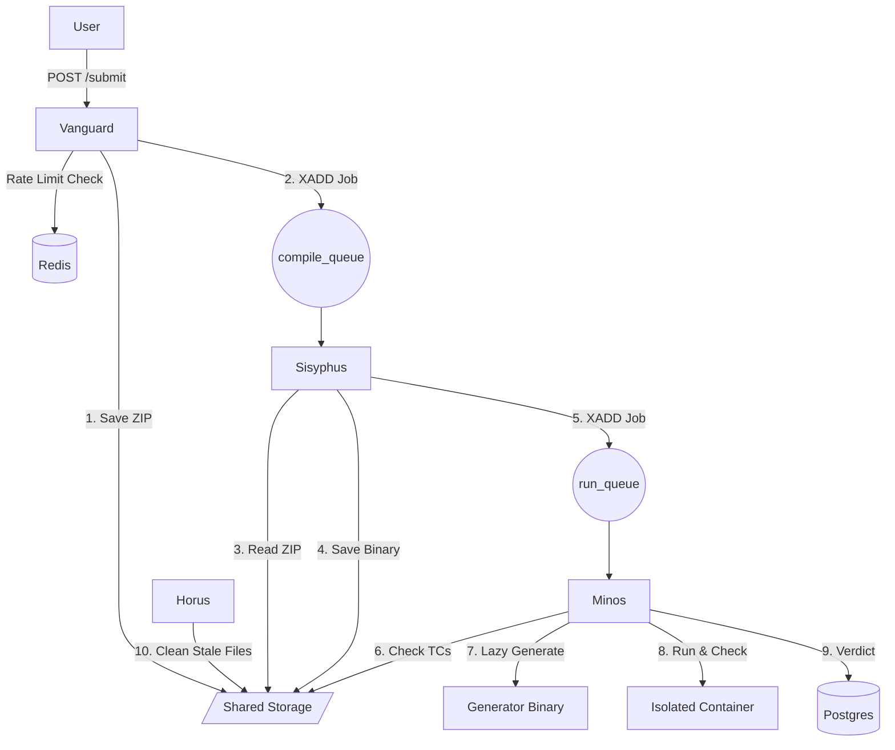

# Olympus Architecture: Distributed Competitive Programming Judge

## 1. System Overview

The system follows a **Distributed Microservices Architecture** built in **Rust** with **Tokio** async runtime. It isolates responsibilities into four distinct services to ensure security, scalability, and fault tolerance.

| Service | Name | Role | Pattern / Focus |
| :--- | :--- | :--- | :--- |
| **API Gateway** | **Vanguard** | Ingestion, Auth, Contest Mgmt, Rate Limiting | REST API, Middleware, Clean Architecture |
| **Compiler** | **Sisyphus** | Compilation Worker | Redis Stream Consumer, Builder |
| **Judge** | **Minos** | Execution & Verification | **Specification Pattern**, Metrics, Sandboxing |
| **Cleaner** | **Horus** | Maintenance & Cleanup | **Specification Pattern**, Cron |

### High-Level Diagram



# 2. Infrastructure & Shared Resources

## Technology Stack
- **Language:** Rust (all services)
- **Async Runtime:** Tokio
- **Database:** PostgreSQL
- **Message Queue:** Redis Streams (`compile_queue`, `run_queue`)
- **Cache & Rate Limiting:** Redis
- **Metrics:** Prometheus/Grafana
- **Containerization:** Docker with cgroups/namespaces

## Workspace Crates
```
olympus/
├── Cargo.toml                 # Workspace root
├── crates/
│   ├── olympus-rules/         # Shared Specification Pattern crate
│   ├── olympus-common/        # Shared types, errors, utilities
│   ├── vanguard/              # API Gateway
│   ├── sisyphus/              # Compiler
│   ├── minos/                 # Judge
│   └── horus/                 # Cleaner
```

## Shared Storage
All services share access to a persistent volume (AWS EBS / NFS / Local Volume) mounted at `/mnt/data`.

```
/mnt/data/
├── uploads/               # Staging area for file uploads (temporary)
│   └── {upload_id}/       # UUID-based upload session
│       ├── submission.zip # User submission (pending validation)
│       ├── generator      # Problem generator binary (pending validation)
│       └── checker        # Problem checker binary (pending validation)
├── submissions/           # Validated & stored user submission ZIPs
│   └── {contest_id}/
│       └── {user_id}/
│           └── {submission_id}.zip
├── binaries/              # Validated executables
│   ├── problems/
│   │   └── {problem_id}/
│   │       ├── generator  # Problem setter's testcase generator
│   │       └── checker    # Problem setter's solution verifier
│   └── users/
│       └── {submission_id}_bin   # The compiled user submission
├── testcases/             # Lazy-loaded cache (Purged by Horus)
│   └── {problem_id}/
│       ├── testcase1.txt
│       └── testcase2.txt
└── temp/                  # Volatile execution scratchpads (Created/Deleted by Minos)
    └── {submission_id}/
```


# 3. Microservice Code Structure

We prioritize maintainability by using Domain-Driven Design (DDD) concepts and the Specification Pattern for complex logic

## A. Vanguard (API Gateway)

Focus: Request handling, Validation, Routing, Rate Limiting. We use a strict folder structure for separation of concerns.

vanguard/
├── Cargo.toml
└── src/
    ├── main.rs
    ├── config.rs              # Env vars, DB pool, Redis pool setup
    ├── middleware/            # Auth, RateLimiting, CORS, RequestID
    │   ├── mod.rs
    │   └── rate_limit.rs      # Redis-based rate limiting
    └── domain/
        ├── auth/              # Feature Module
        │   ├── mod.rs
        │   └── handler/       
        │       ├── mod.rs
        │       ├── handler.rs # Actual implementation
        │       ├── request.rs # Request DTOs
        │       └── response.rs# Response DTOs
        ├── submission/
        │   └── handler/ 
        │       ├── mod.rs
        │       ├── handler.rs
        │       ├── request.rs
        │       └── response.rs
        ├── contest/
        │   └── handler/ {mod, handler, request, response}.rs
        └── health/            # Health Check Endpoint
            └── handler/ {mod, handler, request, response}.rs

### File Upload Flow

All file uploads use `multipart/form-data` with configurable size limits per contest:

1. **Submission Upload:** `POST /api/v1/submissions/upload`
2. **Generator Upload:** `POST /api/v1/problems/{id}/generator`
3. **Checker Upload:** `POST /api/v1/problems/{id}/checker`

Vanguard Code Sample: `submission/handler/handler.rs`

```rs
use axum::extract::Multipart;
use super::{request::SubmitParams, response::SubmitResponse};

/// POST /api/v1/submissions/upload - Upload submission ZIP via multipart
pub async fn upload_submission(
    State(app_state): State<AppState>,
    Extension(user): Extension<AuthUser>,
    Query(params): Query<SubmitParams>,
    mut multipart: Multipart,
) -> Result<Json<SubmitResponse>, AppError> {
    // 1. Get contest-specific upload limit (default 10MB)
    let max_size = get_contest_upload_limit(&app_state.db, params.contest_id).await?;
    
    // 2. Stream file to staging area with size validation
    let upload_id = Uuid::new_v4();
    let staging_path = format!("/mnt/data/uploads/{}/submission.zip", upload_id);
    let file_size = stream_multipart_to_file(&mut multipart, &staging_path, max_size).await?;
    
    // 3. Validate ZIP structure (compile.sh, run.sh must exist)
    validate_zip_structure(&staging_path).await?;
    
    // 4. Move to permanent storage
    let final_path = format!(
        "/mnt/data/submissions/{}/{}/{}.zip",
        params.contest_id, user.id, submission_id
    );
    tokio::fs::rename(&staging_path, &final_path).await?;
    
    // 5. Push to Redis Stream (compile_queue)
    app_state.redis.xadd(
        "compile_queue",
        "*",
        &[
            ("submission_id", submission_id.to_string()),
            ("file_path", final_path),
            ("file_size", file_size.to_string()),
        ],
    ).await?;
    
    Ok(Json(SubmitResponse {
        submission_id,
        status: "QUEUED".to_string(),
    }))
}
```

## B. Minos (The Judge / Runner)

Focus: Security, Metrics, Complex Validation. Uses the **olympus-rules** crate (Specification Pattern) to decouple judging rules from execution logic. Rules can be configured via JSON from the admin dashboard.

minos/
├── Cargo.toml
└── src/
    ├── main.rs
    ├── metrics.rs             # Prometheus/Grafana exporter setup
    ├── worker.rs              # Redis Stream consumer loop
    └── engine/
        ├── isolation.rs       # Namespace/Cgroup wrappers
        └── specs/             # Uses olympus-rules crate
            ├── mod.rs
            ├── runtime_spec.rs  # Checks TLE/MLE limits
            ├── safety_spec.rs   # Checks for forbidden syscalls
            └── verdict_spec.rs  # Checks Diff/Checker output

### Minos Specification Logic (using olympus-rules)
```rs 
use olympus_rules::prelude::*;

// Composable rule for judging
let verdict_rule = WithinTimeLimit(problem.time_limit_ms)
    & WithinMemoryLimit(problem.memory_limit_kb)
    & (ExitCodeZero | AllowedRuntimeError);

if verdict_rule.is_satisfied_by(&execution_result).await {
    // Check output correctness
} else {
    // TLE, MLE, or RE
}
```

### Metrics Collected (Prometheus):

- judge_execution_duration_seconds (Histogram)
- judge_memory_usage_bytes (Gauge)
- judge_verdict_total{type="AC|WA|TLE|RE"} (Counter)

---

# 4. Security & Isolation Model

All remote code execution (user submissions, generators, checkers) **MUST** be sandboxed. This applies to **Sisyphus** (compilation) and **Minos** (execution).

## Isolation Layers

| Layer | Technology | Purpose |
|-------|------------|----------|
| **Container** | Docker / nsjail | Process isolation, filesystem isolation |
| **Namespaces** | Linux namespaces | Network, PID, mount, user isolation |
| **cgroups v2** | Control groups | CPU, memory, I/O limits |
| **seccomp** | Syscall filtering | Block dangerous syscalls |
| **Read-only FS** | tmpfs / overlayfs | Prevent persistent changes |

## Sisyphus (Compilation) Isolation

```yaml
# Compilation sandbox config
isolation:
  network: disabled           # No internet access during compilation
  timeout: 30s                # Hard kill after 30 seconds
  memory_limit: 2GB           # Max RAM for compiler
  cpu_limit: 2 cores          # Max CPU cores
  disk_quota: 500MB           # Max disk usage
  writable_paths:             # Only these paths are writable
    - /tmp/build
    - /home/builder/output
  blocked_syscalls:           # seccomp filter
    - ptrace
    - mount
    - reboot
    - swapon
```

## Minos (Execution) Isolation

```yaml
# Execution sandbox config (stricter than compilation)
isolation:
  network: disabled           # Absolutely no network
  timeout: dynamic            # Per-problem time limit
  memory_limit: dynamic       # Per-problem memory limit
  cpu_limit: 1 core           # Single core for fair timing
  disk_quota: 100MB           # Minimal disk for I/O
  writable_paths:
    - /tmp/run                # Only scratch directory
  readonly_paths:
    - /usr/lib                # System libraries (if needed)
  blocked_syscalls:
    - fork                    # No spawning child processes
    - clone                   # No threading (optional per problem)
    - execve                  # No executing other binaries
    - ptrace
    - socket                  # No sockets whatsoever
    - connect
    - bind
    - listen
```

## Generator/Checker Isolation

Problem setters' binaries (generators, checkers) are also **untrusted** and run in sandbox:

```yaml
# Generator/Checker sandbox (moderate restrictions)
isolation:
  network: disabled
  timeout: 60s                # Generous for test generation
  memory_limit: 4GB           # May need more for large tests
  cpu_limit: 2 cores
  disk_quota: 1GB             # Test files can be large
  allowed_syscalls:           # Whitelist approach
    - read
    - write
    - open
    - close
    - mmap
    - brk
    - exit_group
```

## Sandbox Implementation (nsjail example)

```rs
// minos/src/engine/isolation.rs
use std::process::Command;

pub struct SandboxConfig {
    pub time_limit_ms: u64,
    pub memory_limit_kb: u64,
    pub network_disabled: bool,
    pub max_processes: u32,
}

pub async fn run_sandboxed(
    binary_path: &str,
    input_path: &str,
    output_path: &str,
    config: &SandboxConfig,
) -> Result<ExecutionResult, SandboxError> {
    let mut cmd = Command::new("nsjail");
    
    cmd.args([
        "--mode", "o",                              // Once mode
        "--time_limit", &(config.time_limit_ms / 1000 + 1).to_string(),
        "--rlimit_as", &(config.memory_limit_kb / 1024).to_string(),
        "--max_cpus", "1",
        "--cgroup_mem_max", &(config.memory_limit_kb * 1024).to_string(),
    ]);
    
    if config.network_disabled {
        cmd.args(["--disable_clone_newnet", "false"]); // Enable network namespace (isolated)
    }
    
    cmd.args([
        "--", binary_path,
    ]);
    
    // Redirect stdin/stdout
    cmd.stdin(std::fs::File::open(input_path)?);
    cmd.stdout(std::fs::File::create(output_path)?);
    
    // Execute and measure
    let start = std::time::Instant::now();
    let output = cmd.output()?;
    let duration = start.elapsed();
    
    Ok(ExecutionResult {
        exit_code: output.status.code().unwrap_or(-1),
        duration_ms: duration.as_millis() as u64,
        memory_kb: parse_cgroup_memory_usage()?,
        stderr: String::from_utf8_lossy(&output.stderr).to_string(),
    })
}
```

---

## C. Horus (The Cleaner)
Focus: Maintenance. Uses **olympus-rules** crate with JSON-configurable cleanup policies managed via admin dashboard.

horus/
├── Cargo.toml
└── src/
    ├── main.rs
    └── cleaner/
        ├── scanner.rs         # Walkdir iterator
        ├── config.rs          # Loads JSON policies from DB/Redis
        └── policies/          # Uses olympus-rules crate
            ├── mod.rs
            ├── stale_cache.rs # Spec: "File access time > 6 hours?"
            └── orphan_dir.rs  # Spec: "Directory empty & created > 1 hour ago?"

### Cleanup Policy JSON Example
```json
{
  "cleanup_policies": [
    {
      "name": "stale_testcases",
      "target": "/mnt/data/testcases",
      "rule": {
        "and": [
          { "spec": "LastAccessOlderThan", "params": { "hours": 6 } },
          { "spec": "IsFile" }
        ]
      },
      "action": "delete"
    }
  ]
}
```


# Data Flow: Olympus Architecture

This document details the lifecycle of a submission through the four microservices: **Vanguard** (API), **Sisyphus** (Compiler), **Minos** (Judge), and **Horus** (Cleaner).

---

## Phase 1: Ingestion (Vanguard)
**Goal:** Authenticate user, check rate limits, validate and store files, queue the job.

1.  **Request:** User sends `POST /api/v1/submissions/upload` with `multipart/form-data` containing `file` (the ZIP).
2.  **Middleware Chain:**
    * **Auth:** Verifies JWT token.
    * **RateLimit:** Checks Redis (`INCR rl:submit:{user_id}`) - max 10 submissions/min.
3.  **Size Validation (Streaming):**
    * Fetches contest-specific `max_submission_size_mb` from database (default: 10MB).
    * Streams upload to staging: `/mnt/data/uploads/{upload_id}/submission.zip`.
    * **Rejects immediately** if stream exceeds limit (no buffering entire file in memory).
4.  **ZIP Validation:**
    * Opens ZIP archive and validates required structure:
        * `compile.sh` must exist and be executable.
        * `run.sh` must exist and be executable.
        * No symlinks pointing outside archive.
        * No absolute paths.
        * Total uncompressed size < 5x compressed size (zip bomb protection).
5.  **Storage:** Moves validated ZIP to permanent storage:
    * Path: `/mnt/data/submissions/{contest_id}/{user_id}/{submission_id}.zip`
    * Cleans up staging directory.
6.  **Database:** Creates a record in the `submissions` table:
    * Status: `PENDING`
    * `file_path`: Storage path
    * `file_size_bytes`: Actual file size
    * Timestamp: `Now()`
7.  **Dispatch:** Pushes a message to Redis Stream (`XADD compile_queue * ...`).
    * Payload: `{ "submission_id": "uuid", "file_path": "...", "file_size": "..." }`
8.  **Response:** Returns `202 Accepted` with rate limit headers.

---

## Phase 2: Compilation (Sisyphus)
**Goal:** Convert source code into an executable binary in a fully isolated environment.

1.  **Consumer:** Sisyphus reads from Redis Stream (`XREADGROUP sisyphus_group worker_1 compile_queue >`).
2.  **Preparation:**
    * Creates isolated build environment using nsjail/Docker.
    * Mounts submission ZIP as read-only.
    * Creates writable `/tmp/build` and `/home/builder/output` directories.
3.  **⚠️ ISOLATED Build Execution:**
    * **Network:** Completely disabled (no DNS, no outbound connections).
    * **Filesystem:** Read-only except designated output paths.
    * **Resources:** 2GB RAM, 2 CPU cores, 500MB disk quota.
    * **Timeout:** Hard kill after 30 seconds.
    * **Syscalls:** seccomp filter blocks dangerous operations (ptrace, mount, etc.).
    * Executes `compile.sh` inside the sandbox.
4.  **Binary Validation:**
    * Scans output binary for suspicious patterns (optional).
    * Verifies binary is ELF executable (Linux) or appropriate format.
    * Checks binary size is reasonable (< 100MB).
5.  **Outcome Handling:**
    * **If Success (Exit Code 0):**
        * Moves the resulting binary to `/mnt/data/binaries/users/{submission_id}_bin`.
        * Updates DB Status: `COMPILED`.
        * Pushes message to Redis Stream (`XADD run_queue * ...`).
        * Acknowledges message (`XACK compile_queue sisyphus_group {id}`).
    * **If Failure:**
        * Captures `stderr` logs (sanitized, max 64KB).
        * Updates DB Status: `COMPILATION_ERROR`.
        * Stores logs in `submission_logs` table for user feedback.
        * Acknowledges message.
6.  **Cleanup:**
    * Destroys sandbox container/namespace.
    * Removes temporary build files.

---

## Phase 3: Execution & Judging (Minos)
**Goal:** Run user binary against test cases in a **strictly isolated** sandbox and verify output.

1.  **Consumer:** Minos reads from Redis Stream (`XREADGROUP minos_group worker_1 run_queue >`).
2.  **Test Case Resolution (Lazy Loading):**
    * Checks `/mnt/data/testcases/{problem_id}/`.
    * **Hit:** Files exist. Updates "Last Accessed" timestamp.
    * **Miss:**
        * Locates Generator: `/mnt/data/binaries/problems/{problem_id}/generator`.
        * ⚠️ **Runs Generator in sandbox** (generators are untrusted code!).
        * Saves outputs to `/mnt/data/testcases/{problem_id}/`.
3.  **⚠️ STRICT Isolation Setup:**
    * Creates volatile directory: `/mnt/data/temp/{submission_id}/`.
    * Prepares nsjail/sandbox configuration:
        * **Network:** Completely disabled (no loopback either).
        * **Filesystem:** Only `/tmp/run` writable, everything else read-only.
        * **PID Namespace:** Isolated process tree.
        * **User Namespace:** Runs as unprivileged user (nobody/65534).
        * **seccomp:** Strict syscall whitelist (read, write, mmap, brk, exit).
        * **No fork/clone:** Prevents spawning child processes.
        * **No execve:** Cannot execute other binaries.
4.  **The Run Loop (For each test case):**
    * **Execute in Sandbox:** `sandbox_run ./user_binary < input.txt > output.txt`
    * **Resource Limits:**
        * CPU: Single core, per-problem time limit.
        * RAM: Per-problem memory limit via cgroups.
        * Disk: 100MB max output.
    * **Metrics:** Captures precise runtime (wall clock + CPU time) and peak memory.
    * **Constraint Check (olympus-rules Specification Pattern):**
        * *Time Limit Exceeded (TLE)?* -> Record, continue or stop based on config.
        * *Memory Limit Exceeded (MLE)?* -> Record, continue or stop.
        * *Runtime Error (RE)?* (Non-zero exit, signal) -> Record.
5.  **⚠️ ISOLATED Verification:**
    * Checker binary is also **untrusted** (problem setter code).
    * Runs checker in sandbox: `sandbox_run ./checker input.txt expected.txt output.txt`.
    * Result: `AC` (Accepted) or `WA` (Wrong Answer).
6.  **Finalize:**
    * Updates DB with final verdict (e.g., `AC`, `WA`, `TLE`, `MLE`, `RE`).
    * Stores per-testcase results in `submission_results` table.
    * Acknowledges message (`XACK run_queue minos_group {id}`).
    * **Cleanup:** Destroys sandbox, deletes `/mnt/data/temp/{submission_id}/` immediately.

---

## Phase 4: Maintenance (Horus)
**Goal:** Manage disk usage and clean up stale data using JSON-configurable policies.

1.  **Trigger:** Cron Job (Runs every 30 minutes).
2.  **Load Policies:** Fetches cleanup rules from database (configured via admin dashboard).
3.  **Stale Cache Policy:**
    * Scans `/mnt/data/testcases/`.
    * Reads directory metadata (Last Access Time).
    * **Action:** If `LastAccessOlderThan(6 hours) & IsFile`, perform `rm -rf`.
4.  **Orphan Cleanup Policy:**
    * Scans `/mnt/data/temp/`.
    * Checks for execution folders older than 1 hour (indicating a crashed Minos worker).
    * **Action:** If `CreatedOlderThan(1 hour) & IsDirectory & !HasActiveSubmission`, force delete.
