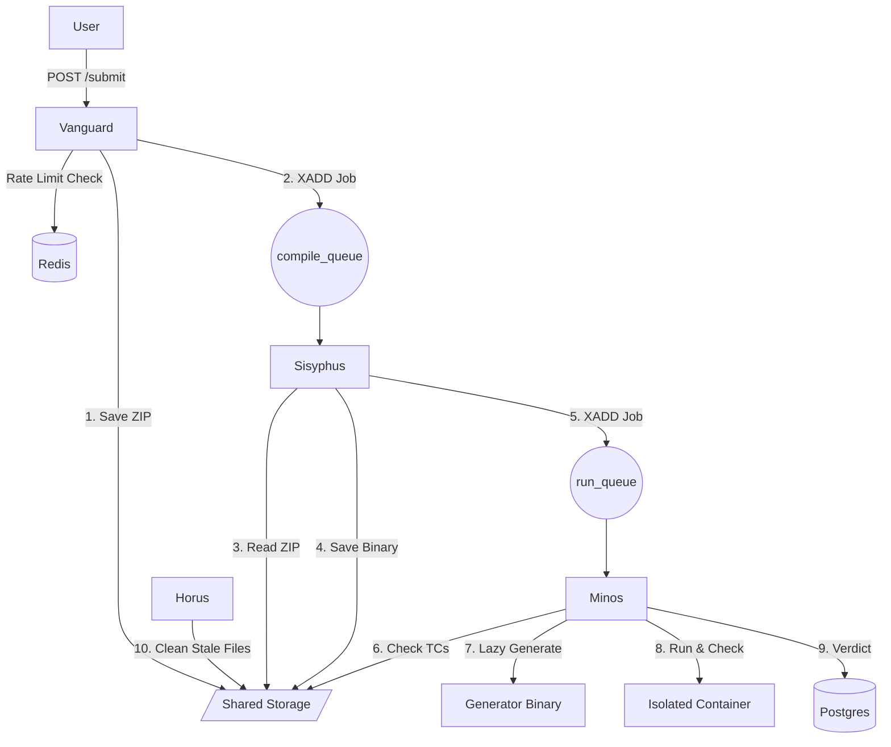

# Olympus Architecture: Distributed Competitive Programming Judge

## 1. System Overview

The system follows a **Distributed Microservices Architecture** built in **Rust** with **Tokio** async runtime. It isolates responsibilities into four distinct services to ensure security, scalability, and fault tolerance.

| Service | Name | Role | Pattern / Focus |
| :--- | :--- | :--- | :--- |
| **API Gateway** | **Vanguard** | Ingestion, Auth, Contest Mgmt, Rate Limiting | REST API, Middleware, Clean Architecture |
| **Compiler** | **Sisyphus** | Compilation Worker | Redis Stream Consumer, Builder |
| **Judge** | **Minos** | Execution & Verification | **Specification Pattern**, Metrics, Sandboxing |
| **Cleaner** | **Horus** | Maintenance & Cleanup | **Specification Pattern**, Cron |

### High-Level Diagram



# 2. Infrastructure & Shared Resources

## Technology Stack
- **Language:** Rust (all services)
- **Async Runtime:** Tokio
- **Database:** PostgreSQL
- **Message Queue:** Redis Streams (`compile_queue`, `run_queue`)
- **Cache & Rate Limiting:** Redis
- **Metrics:** Prometheus/Grafana
- **Containerization:** Docker with cgroups/namespaces

## Workspace Crates
```
olympus/
├── Cargo.toml                 # Workspace root
├── crates/
│   ├── olympus-rules/         # Shared Specification Pattern crate
│   ├── olympus-common/        # Shared types, errors, utilities
│   ├── vanguard/              # API Gateway
│   ├── sisyphus/              # Compiler
│   ├── minos/                 # Judge
│   └── horus/                 # Cleaner
```

## Shared Storage
All services share access to a persistent volume (AWS EBS / NFS / Local Volume) mounted at `/mnt/data`.

/mnt/data/
├── submissions/           # Raw Zips uploaded by users
│   └── {q_id}/
│       └── {user_id}/
│           └── {sub_id}.zip
├── binaries/              # Executables
│   ├── problems/
│   │   └── {q_id}/
│   │       ├── generator  # Problem setter's testcase generator
│   │       └── checker    # Problem setter's solution verifier
│   └── users/
│       └── {sub_id}_bin   # The compiled user submission
├── testcases/             # Lazy-loaded cache (Purged by Horus)
│   └── {q_id}/
│       ├── testcase1.txt
│       └── testcase2.txt
└── temp/                  # Volatile execution scratchpads (Created/Deleted by Minos)


# 3. Microservice Code Structure

We prioritize maintainability by using Domain-Driven Design (DDD) concepts and the Specification Pattern for complex logic

## A. Vanguard (API Gateway)

Focus: Request handling, Validation, Routing, Rate Limiting. We use a strict folder structure for separation of concerns.

vanguard/
├── Cargo.toml
└── src/
    ├── main.rs
    ├── config.rs              # Env vars, DB pool, Redis pool setup
    ├── middleware/            # Auth, RateLimiting, CORS, RequestID
    │   ├── mod.rs
    │   └── rate_limit.rs      # Redis-based rate limiting
    └── domain/
        ├── auth/              # Feature Module
        │   ├── mod.rs
        │   └── handler/       
        │       ├── mod.rs
        │       ├── handler.rs # Actual implementation
        │       ├── request.rs # Request DTOs
        │       └── response.rs# Response DTOs
        ├── submission/
        │   └── handler/ 
        │       ├── mod.rs
        │       ├── handler.rs
        │       ├── request.rs
        │       └── response.rs
        ├── contest/
        │   └── handler/ {mod, handler, request, response}.rs
        └── health/            # Health Check Endpoint
            └── handler/ {mod, handler, request, response}.rs

Vanguard Code Sample: `submission/handler/handler.rs`

```rs
use super::{request::SubmitRequest, response::SubmitResponse};

pub async fn submit_code(
    State(app_state): State<AppState>,
    Json(payload): Json<SubmitRequest>,
) -> Result<Json<SubmitResponse>, AppError> {
    // 1. Logic to save zip to /mnt/data/...
    // 2. Push to Redis Stream (compile_queue)
    app_state.redis.xadd(
        "compile_queue",
        "*",
        &[("submission_id", uuid.to_string()), ("file_path", file_path)],
    ).await?;
    
    Ok(Json(SubmitResponse {
        submission_id: uuid,
        status: "QUEUED".to_string(),
    }))
}
```

## B. Minos (The Judge / Runner)

Focus: Security, Metrics, Complex Validation. Uses the **olympus-rules** crate (Specification Pattern) to decouple judging rules from execution logic. Rules can be configured via JSON from the admin dashboard.

minos/
├── Cargo.toml
└── src/
    ├── main.rs
    ├── metrics.rs             # Prometheus/Grafana exporter setup
    ├── worker.rs              # Redis Stream consumer loop
    └── engine/
        ├── isolation.rs       # Namespace/Cgroup wrappers
        └── specs/             # Uses olympus-rules crate
            ├── mod.rs
            ├── runtime_spec.rs  # Checks TLE/MLE limits
            ├── safety_spec.rs   # Checks for forbidden syscalls
            └── verdict_spec.rs  # Checks Diff/Checker output

### Minos Specification Logic (using olympus-rules)
```rs 
use olympus_rules::prelude::*;

// Composable rule for judging
let verdict_rule = WithinTimeLimit(problem.time_limit_ms)
    & WithinMemoryLimit(problem.memory_limit_kb)
    & (ExitCodeZero | AllowedRuntimeError);

if verdict_rule.is_satisfied_by(&execution_result).await {
    // Check output correctness
} else {
    // TLE, MLE, or RE
}
```

### Metrics Collected (Prometheus):

- judge_execution_duration_seconds (Histogram)
- judge_memory_usage_bytes (Gauge)
- judge_verdict_total{type="AC|WA|TLE|RE"} (Counter)

## C. Horus (The Cleaner)
Focus: Maintenance. Uses **olympus-rules** crate with JSON-configurable cleanup policies managed via admin dashboard.

horus/
├── Cargo.toml
└── src/
    ├── main.rs
    └── cleaner/
        ├── scanner.rs         # Walkdir iterator
        ├── config.rs          # Loads JSON policies from DB/Redis
        └── policies/          # Uses olympus-rules crate
            ├── mod.rs
            ├── stale_cache.rs # Spec: "File access time > 6 hours?"
            └── orphan_dir.rs  # Spec: "Directory empty & created > 1 hour ago?"

### Cleanup Policy JSON Example
```json
{
  "cleanup_policies": [
    {
      "name": "stale_testcases",
      "target": "/mnt/data/testcases",
      "rule": {
        "and": [
          { "spec": "LastAccessOlderThan", "params": { "hours": 6 } },
          { "spec": "IsFile" }
        ]
      },
      "action": "delete"
    }
  ]
}
```


# Data Flow: Olympus Architecture

This document details the lifecycle of a submission through the four microservices: **Vanguard** (API), **Sisyphus** (Compiler), **Minos** (Judge), and **Horus** (Cleaner).

---

## Phase 1: Ingestion (Vanguard)
**Goal:** Authenticate user, check rate limits, store raw files, and queue the job.

1.  **Request:** User sends `POST /api/v1/submit` with `multipart/form-data` containing `solution.zip`.
2.  **Middleware Chain:**
    * **Auth:** Verifies JWT token.
    * **RateLimit:** Checks Redis (`INCR rl:submit:{user_id}`) - max 10 submissions/min.
    * **Validator:** Ensures file size < 10MB and format is `.zip`.
3.  **Storage:** Vanguard streams the zip file to persistent storage:
    * Path: `/mnt/data/submissions/{contest_id}/{user_id}/{submission_id}.zip`
4.  **Database:** Creates a record in the `submissions` table:
    * Status: `PENDING`
    * Timestamp: `Now()`
5.  **Dispatch:** Pushes a message to Redis Stream (`XADD compile_queue * ...`).
    * Payload: `{ "submission_id": "uuid", "file_path": "..." }`
6.  **Response:** Returns `202 Accepted` with rate limit headers.

---

## Phase 2: Compilation (Sisyphus)
**Goal:** Convert source code into an executable binary.

1.  **Consumer:** Sisyphus reads from Redis Stream (`XREADGROUP sisyphus_group worker_1 compile_queue >`).
2.  **Preparation:**
    * Creates a temporary build directory.
    * Unzips the submission file.
3.  **Build Execution:**
    * Locates `compile.sh` in the extracted files.
    * Executes `compile.sh` inside a lightweight container (network disabled).
    * **Timeout:** Kills process if it exceeds 30 seconds.
4.  **Outcome Handling:**
    * **If Success (Exit Code 0):**
        * Moves the resulting binary to `/mnt/data/binaries/users/{submission_id}_bin`.
        * Updates DB Status: `COMPILING_SUCCESS`.
        * Pushes message to Redis Stream (`XADD run_queue * ...`).
        * Acknowledges message (`XACK compile_queue sisyphus_group {id}`).
    * **If Failure:**
        * Captures `stderr` logs.
        * Updates DB Status: `COMPILATION_ERROR`.
        * Stores logs in `submission_logs` table for user feedback.
        * Acknowledges message.

---

## Phase 3: Execution & Judging (Minos)
**Goal:** Run the binary against test cases and verify output.

1.  **Consumer:** Minos reads from Redis Stream (`XREADGROUP minos_group worker_1 run_queue >`).
2.  **Test Case Resolution (Lazy Loading):**
    * Checks `/mnt/data/testcases/{problem_id}/`.
    * **Hit:** Files exist. Updates "Last Accessed" timestamp.
    * **Miss:**
        * Locates Generator: `/mnt/data/binaries/problems/{problem_id}/generator`.
        * Runs Generator.
        * Saves outputs to `/mnt/data/testcases/{problem_id}/`.
3.  **Isolation Setup:**
    * Creates a volatile directory: `/mnt/data/temp/{submission_id}/`.
    * Copies: User Binary, Test Cases, and Checker Binary.
4.  **The Run Loop (For each test case):**
    * **Sandbox:** Uses `cgroups` (RAM/CPU limits) and `namespaces` (Network isolation).
    * **Execute:** `./user_binary < input.txt > output.txt`.
    * **Metrics:** Captures Runtime and Memory usage.
    * **Constraint Check (olympus-rules Specification Pattern):**
        * *Time Limit Exceeded (TLE)?* -> Stop.
        * *Memory Limit Exceeded (MLE)?* -> Stop.
        * *Runtime Error (RE)?* (Non-zero exit code) -> Stop.
5.  **Verification:**
    * Runs: `./checker input.txt output.txt`.
    * Result: `AC` (Accepted) or `WA` (Wrong Answer).
6.  **Finalize:**
    * Updates DB with final verdict (e.g., `AC`, `WA`, `TLE`).
    * Acknowledges message (`XACK run_queue minos_group {id}`).
    * **Cleanup:** Deletes `/mnt/data/temp/{submission_id}/` immediately.

---

## Phase 4: Maintenance (Horus)
**Goal:** Manage disk usage and clean up stale data using JSON-configurable policies.

1.  **Trigger:** Cron Job (Runs every 30 minutes).
2.  **Load Policies:** Fetches cleanup rules from database (configured via admin dashboard).
3.  **Stale Cache Policy:**
    * Scans `/mnt/data/testcases/`.
    * Reads directory metadata (Last Access Time).
    * **Action:** If `LastAccessOlderThan(6 hours) & IsFile`, perform `rm -rf`.
4.  **Orphan Cleanup Policy:**
    * Scans `/mnt/data/temp/`.
    * Checks for execution folders older than 1 hour (indicating a crashed Minos worker).
    * **Action:** If `CreatedOlderThan(1 hour) & IsDirectory & !HasActiveSubmission`, force delete.
